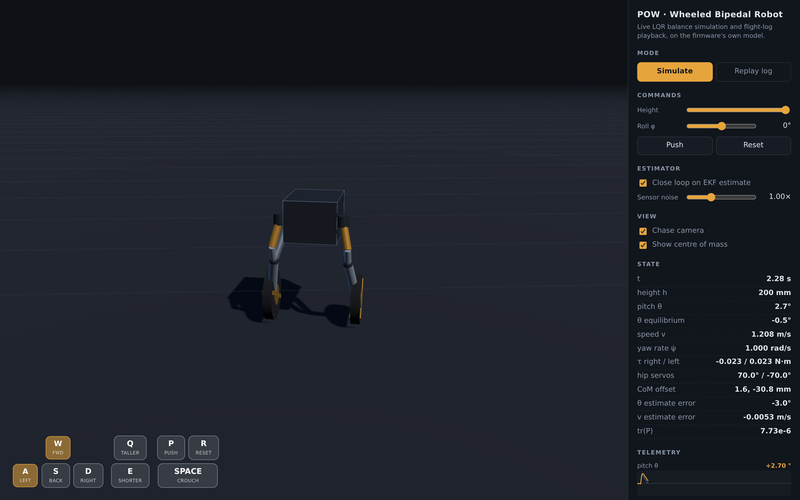

# POW — Wheeled Bipedal Robot Simulator

A browser 3D simulator and log visualiser for the **POW** wheeled bipedal
robot, built on the robot's own control model rather than on a generic physics
engine. Open `index.html` — there is no build step and no network dependency.



## What it does

**Simulate.** The firmware's model runs live in the browser: the five-bar leg
inverse kinematics sets the hip servos for the commanded height, the seven
upper links are aggregated into an equivalent body (CoM offset and inertia
tensor), synthetic IMU and encoder readings go into the extended Kalman filter,
and the gain-scheduled LQR closes the loop around the *estimate* — all at the
firmware's 8 ms sampling period, in the order `WBR_Control.ino` does it. You
fly it with the keyboard; it balances, or falls over and resets if you shove it
hard enough.

**Replay log.** The same robot is driven from flight logs recorded on the real
hardware, so you can watch what actually happened during a balancing run, a
squat, a top-speed pass or a yaw-rate test, with the telemetry beside it.

## Controls

| Key       | Action                                    |
| --------- | ----------------------------------------- |
| `W` / `S` | forward / reverse velocity command (±1 m/s) |
| `A` / `D` | yaw rate command (±1 rad/s)               |
| `Q` / `E` | raise / lower the body (70–200 mm)        |
| `Space`   | hold to crouch to minimum height          |
| `P`       | shove the robot, to watch the LQR reject it |
| `R`       | reset                                     |

Arrow keys mirror `Q`/`E`/`A`/`D`, and the on-screen pads work with mouse and
touch. Uncheck *Chase camera* to orbit the robot freely.

## The estimator

On the robot the controller never sees the true state — it sees what the EKF
makes of an accelerometer, a rate gyro and two motor encoders. The simulator
does the same, so that what you are watching is the loop the hardware actually
closes.

Measurements are generated from the true state through the same observation
model the filter inverts, then corrupted with Gaussian noise whose variances
are the ones the firmware carries in its commented-out "identified" `R` matrix
(`EKF.h`). The *Sensor noise* slider scales those; the checkbox switches the
LQR between the estimate and ground truth, so you can see what the estimator
costs you.

The state panel reports `θ estimate error`, `v estimate error` and `tr(P)`,
and the pitch chart draws the estimate as a ghost line behind the truth.

One honest limitation: model and plant are the *same* `POL` instance, so there
is no parameter mismatch to cope with. What the filter faces is sensor noise
plus one real modelling error — the firmware's `predict_measurement` drops the
`theta_ddot`, `v_dot` and `psi_ddot` terms from the accelerometer model (they
are commented out in `EKF.h`), while the simulated accelerometer includes them.
That is measurable: with noise off and the terms dropped from the measurement
too, the steady-state pitch error is exactly 0.000°; with the true
accelerations present it is 0.221° at 0.8 m/s, and zero at rest. The bias only
appears while accelerating, which is precisely what you would expect.

## Where the numbers come from

Everything physical is transcribed from
[SeungbinOh/Pow_WBR_Project](https://github.com/SeungbinOh/Pow_WBR_Project):

| This repo                | Ported from                             |
| ------------------------ | --------------------------------------- |
| `src/params.js`          | `ESP32/WBR_Control/Params.h` — link lengths, masses, CoM offsets, inertia tensors, operating limits |
| `src/params.js` (gains)  | `ESP32/WBR_Control/VYBController.h` — the 14-entry LQR gain schedule |
| `src/pol.js`             | `ESP32/WBR_Control/POL.h` — inverse and forward kinematics, CoM/inertia aggregation, mass matrix and nonlinear effects |
| `src/lqr.js`             | `ESP32/WBR_Control/VYBController.h` — gain interpolation, torque saturation |
| `src/ekf.js`             | `ESP32/WBR_Control/EKF.h` — predict/update, `R` and `Q` tuning |
| `src/sensors.js`         | `ESP32/WBR_Control/EKF.h` — the observation model and its Jacobian, run forwards to synthesise measurements |
| `index.js` control order | `ESP32/WBR_Control/WBR_Control.ino` — the sequence of the main loop |
| `data/*.csv`             | `MATLAB/log_plot/` and `MATLAB/test_data/`, thinned to ~4000 samples and reduced to the state/reference/torque columns |

The chassis box you see is not a guess: its dimensions are recovered from the
body inertia tensor in `Params.h` (207 × 144 × 114 mm), and it is drawn at the
body's real CoM offset.

### Model summary

State `x = [θ, θ̇, v, ψ̇]` — body pitch, pitch rate, forward velocity of the
wheel axle, yaw rate. Input `u = [τ_RW, τ_LW]`, the two wheel torques.
Dynamics `M(θ) q̈ + nle = B u`, with

```
B = [  1    -1  ]
    [ -1/R   1/R]
    [ -L/R  -L/R]
```

`M` and `nle` depend on the commanded height through the aggregated body: at
each control step the leg pose is re-solved, the CoM offset `p_bcom` and
inertia `I_B_B` are recomputed, and the LQR gain is re-interpolated. The pitch
reference is the equilibrium angle `atan(-p_bcom_x / (h + p_bcom_z))`, which
puts the centre of mass over the wheel contact — the same thing
`WBR_Control.ino` does every loop.

### Five deliberate deviations from the firmware

All five are bugs in the original C++ that a simulator cannot live with. Each
is marked in the source where it occurs, and each was confirmed numerically
rather than assumed.

1. **`POL::calculate_com_and_inertia` accumulates.** `p_bcom` and `I_B_B` are
   never zeroed before the summation, so on the hardware they grow without
   bound across calls. Here they are reset each time.
2. **`POL::solve_inverse_kinematics` overwrites `phi` with radians.** The member
   is documented as degrees and is converted in place on every call, so the
   commanded roll shrinks by a factor of 57.3 per control step. Here the
   commanded value is kept in degrees and converted locally.
3. **`POL::calculate_nle` closes a parenthesis early in the yaw equation.** The
   last three terms end up added straight into `nle(2)` instead of being scaled
   by `ψ̇θ̇`, leaving a constant ~2.3 rad/s² yaw acceleration at rest with no
   torque applied. Two things identify it as a precedence slip: the dangling
   terms are exactly twice the matching ones in the pitch equation, and the
   firmware's own derivative, `calculate_dnle_dtheta`, groups them *inside* the
   `ψ̇θ̇` factor. The firmware disagrees with itself, and it is `nle(2)` that is
   wrong. Without this fix the robot spins on the spot.
4. **The three Jacobian routines carry a family of index slips.**
   `calculate_dM_dtheta`, `calculate_dnle_dtheta` and `calculate_dnle_dqdot`
   read `I(2,2)` as `I(2,0)`, `I(2,1)` as `I(2,0)` and `I(1,1)` as `I(1,0)` —
   the signature of a hand transcription from the MATLAB derivation. Counting
   the inertia references makes it plain: the Jacobians reference `I_B_B(2,0)`
   twelve times against `I_B_B(2,2)`'s seven, while the functions they
   differentiate use `(2,2)` fifteen times. Checked against a finite difference
   of `massMatrix` and `nle`, the transcribed versions are wrong by up to a
   factor of seven on the yaw entries. Here `nle` and `jacobians` are both
   derived from one shared set of coefficients (`POL.modelCoefficients`), which
   makes them consistent by construction; they agree with finite differences to
   4e-9.
5. **`EKF::predict` propagates the covariance with the continuous Jacobian.**
   `POL::predict_state` integrates the state with an explicit Euler step but
   hands back `fx = df/dx`, and `P_pred = F P Fᵀ + Q` then uses it as if it were
   the discrete transition matrix. The covariance of an Euler step propagates
   through the Jacobian *of that step*, `I + (df/dx)·dt`. The difference is not
   subtle: from `P = I`, the firmware's version reaches `tr(P) = 1.5e76` after
   40 steps (0.32 s), while the corrected one reaches 5.3e3 and settles around
   5e-6 once the measurement update is in the loop.

Note also that the inverse and forward kinematics are not perfectly consistent
with each other in the original: the IK solves a triangle that the FK chain
then reproduces to within 2.30 mm on the calf length — 1.7% of it, worst around
h = 114 mm. That discrepancy is inherited as-is, since it is what the hardware
actually commands. `test/verify.mjs` pins the figure so it cannot drift
unnoticed.

## Checking it

```
node test/verify.mjs
```

No dependencies, no browser. It re-derives every numerical claim above: that
the five-bar closes, that the analytic Jacobians match finite differences, that
the firmware's covariance recursion diverges where the corrected one does not,
that the loop stays upright and tracks under sensor noise, and that the
estimator's only bias comes from the dropped acceleration terms.

## Layout

```
index.html          page, styling, key pads, import map
index.js            scene setup, control loop, UI wiring
src/params.js       physical parameters and the LQR gain schedule
src/mat.js          3x3 matrix and vector helpers
src/linalg.js       general dense matrix helpers, for the estimator
src/pol.js          kinematics, body aggregation, dynamics, Jacobians
src/lqr.js          gain-scheduled LQR
src/ekf.js          extended Kalman filter
src/sensors.js      observation model and synthetic IMU / encoder readings
src/robot3d.js      three.js robot assembly and scene
src/hud.js          rolling telemetry charts
src/logplayer.js    CSV flight-log parsing and playback
test/verify.mjs     numerical checks for everything claimed above
data/               flight logs from the real robot
vendor/             three.js r169 (see vendor/README.md)
```

## Licence and attribution

Three.js is MIT, vendored under `vendor/` with its licence. The robot model,
control gains and flight logs originate from the POW capstone project by
Seungbin Oh, Jungbin Park and Woodaengtang; see that repository for its own
terms. The viewer's shape — full-bleed canvas with on-screen WASD pads —
follows the NavBot-EN01 simulator.
